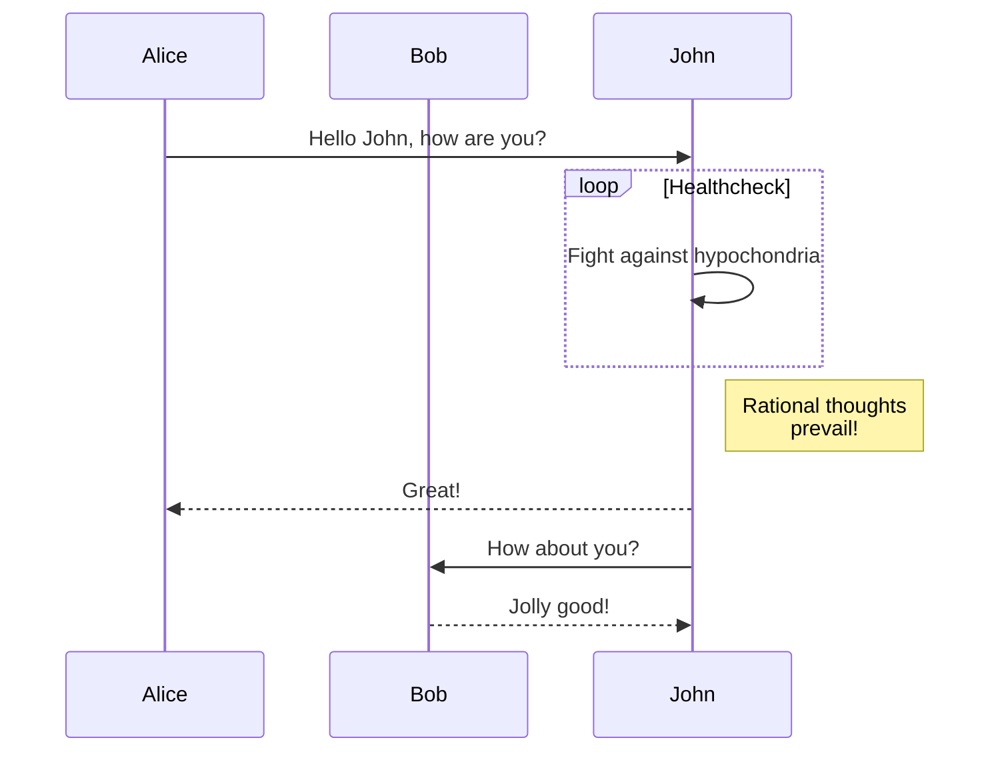

# Mermaid

### 概述

Mermaid lets you create diagrams and visualizations using text and code.

It is a JavaScript based diagramming and charting tool that renders Markdown-inspired text definitions to create and modify diagrams dynamically.

The main purpose of Mermaid is to help documentation catch up with development.


Mermaid 官网


### 流程图 Flowchart

#### 示例一

### 时序图 Sequence diagram

#### 示例一

### 甘特图 Gantt diagram

#### 示例一

### 类图 Class diagram

#### 示例一
