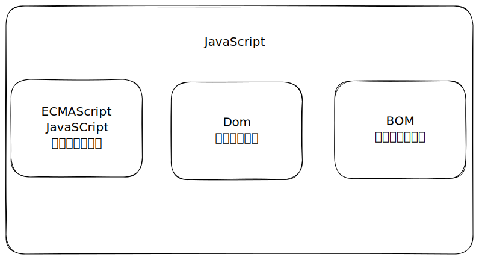
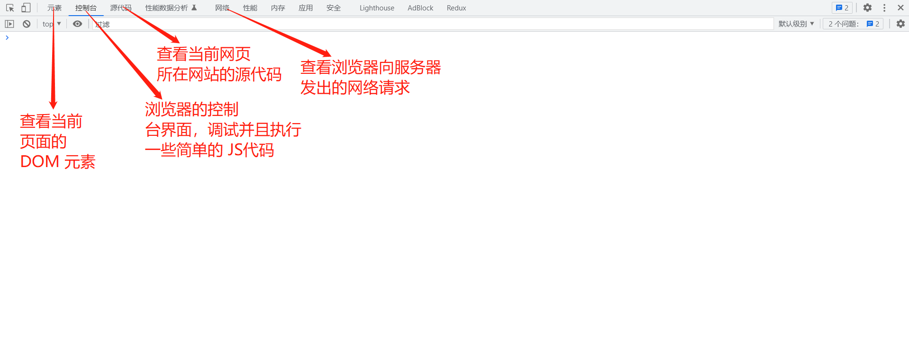

# Full Guide

### 为什么出现 JavaScript

1995，JavaScript 诞生了。它出现的主要用途是代替 Perl 等服务器端语言处理表单的输入验证。在次之前，要验证某个必填字段是否已填写，或者输入的值是否符合要求，需要用户点击按钮提交该表单到服务器端，由服务器端进行验证，并返回结果给用户。而这一过程需要一次 HTTP 通信，即客户端发送请求给服务端，服务端接收并处理请求，然后返回响应结果，显然在用户访问量很大的时候，服务器响应速度会受到很大的限制，并且在那个年代，网络的发展远没有现在出现的 4G、5G 这些技术这么发达，普遍通过电话拨号上网，因此每一次来回的通信时间都影响着用户浏览网页的体验。于是网景公司通过在其 Navigator 浏览器中加入 JavaScript 来改变这个局面，由客户端处理某些基本的表单输入验证。

因此，JavaScript 的出现与 HTML、CSS 一起成为了 Web 开发的核心技术之一，它给网页增添了许多动态地行为。是 Web 领域的技术革新。

### JavaScript 的历史

1995 年，网景公司的工程师 Brendan Eich 开始为即将发布的 NetScape Navigator 2 开发一个叫 Mocha（后改名为 LiveScript）的脚本语言。当时的计划是在客户端和服务器端都使用它，它在服务器端叫 LiveWire。为了赶上发布时间，网景与 Sun 公司共同完成 LiveScript 的开发。就在 NetScape Navigator 2 正式发布前，为了迎合 Java 的热度，网景把 LiveScript 改名为 JavaScript。因此这两门语言并没有直接关系。

由于 JavaScript 的出现很成功，网景的 NetScape Navigator 浏览器在 Web 领域受到了很大的欢迎程度，因此微软也想在 IE 浏览器中加入这种技术，取名叫 JScript 的 JavaScript 的实现。

此时出现了两个版本的浏览器脚本语言的实现，一个是 Netscape Navigator 中的 JavaScript，一个是 IE 中的 JScript。与 C 语言以及很多其他编程语言不同，JavaScript 还没有规范其语法或特性的标准，两个版本的并存让这个问题更加突出。因此业界迫切需要一种统一的 JavaScript 标准，从而让他们写的代码能同时适用于这两个浏览器。

1997 年，JavaScript 1.1 作为提案被交给欧洲计算机制造商协会（Ecma）。第 39 技术委员会（TC39）承担了“标准化一门通用、跨平台、厂商中立的脚本语言的语法和语义”的任务。TC39 委员会由来自网景、Sun、微软、Borland、Nombas 和其它对这门脚本语言有兴趣的公司的工程师租组成。他们花了数月时间制定了 ECMA-263，也就是 ECMAScript 这个新的脚本语言标准。

此后，各个浏览器供应商都以 ECMAScript 作为自己的 JavaScript 实现的依据，虽然具体实现各有不同。所有的浏览器基本上对于 ES5 提供了完善的支持，而对 ES6 及以后的支持度则没有那么广泛，目前 Google 的 Chrome 浏览器是对 ES6 及以后的版本支持最好的。因此对于这个问题，Bable 诞生了，它可以将 ES6 及以前的 JavaScript 代码转译成 ES5 或其之后的 JavaScript 代码，做到向后兼容，同时也可以最大限度地使用新的 ES 语法。

随着 Node.js 的出现，JavaScript 已经可以脱离浏览器环境运行在 Node.js 提供的 JavaScript 运行时环境中。因此 JavaScript 的使用范围、受欢迎程度又得到了进一步的加强，现在它不仅可以用户客户端编程的语言，也可以用在服务端编程的语言。

### JavaScript 的组成

JavaScript 由三部分组成：

* 核心（ECMAScript）
  * 语法
  * 类型
  * 语句
  * 关键字
  * 保留字
  * 操作符
  * 全局对象
* 文档对象模型（DOM），W3C 制定 DOM 的标准，DOM API 技术可以动态地更新网页的内容和结构，甚至是样式，使得用户与网页交互的过程中不需要刷新页面即可改变页面外观和内容，提高了用户的体验。
* 浏览器对象模型（BOM），BOM API 用于支持访问和操作浏览器的窗口。

### JavaScript 的功能

浏览器中的 JavaScript 可以做与网页操作、用户交互和 Web 服务器相关的所有事情。

例如，浏览器中的 JavaScript 可以做下面这些事：

* 在网页中添加新的 HTML，修改网页已有内容和网页的样式。
* 响应用户的行为，响应鼠标的点击，指针的移动，按键的按动。
* 向远程服务器发送网络请求，下载和上传文件（所谓的 [AJAX](https://en.wikipedia.org/wiki/Ajax\_\(programming\)) 和 [COMET](https://en.wikipedia.org/wiki/Comet\_\(programming\)) 技术）。
* 获取或设置 cookie，向访问者提出问题或发送消息。
* 记住客户端的数据（“本地存储”）。

### 一些学习 JavaScript 的要求

**代码编辑器**

* VSCode
* WebStorm

**浏览器**

* Chrome
* Firefox
* Edge

**调试工具**

在大多数浏览器环境下，使用 F12 打开开发者控制台对 JavaScript 代码进行调试。

<figure><figcaption></figcaption></figure>
